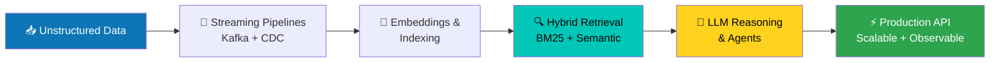

<!-- ============ HEADER BANNER ============ -->

  

  
  
  

---

### 🧠 About Me
💡 Backend Engineer specializing in **scalable distributed systems** with deep, hands-on experience across **AI/ML** and **Generative AI**.
⚙️ I build robust **microservices**, real-time **data pipelines**, and **LLM-powered systems**; RAG, semantic search, and AI agents.
 
🌱 Currently going deeper into **agent orchestration**, **vector retrieval at scale**, and **AI-native infrastructure**.
  
📫 Reach me at: **nishantsaharan94167@gmail.com**

  
  

---

### 💻 Tech Stack

#### 🧩 Languages

  

  

#### 🤖 AI / ML & GenAI

  
  
  
  
  
  

  <em>RAG Pipelines • Semantic Search • Embeddings & Vector Search • Prompt Engineering • Ranking Systems • Information Retrieval • Feature Engineering</em>

#### 🗄️ Vector & Search

  
  
  
  

#### ☁️ Cloud & MLOps

  

  
  

  <em>EC2 • RDS • EKS • Lambda • Kinesis • SNS • SQS • DMS • IaC</em>

#### 🗃️ Databases & Data Engineering

  

  <em>Batch & Streaming Pipelines • CDC • Structured & Unstructured Data Processing</em>

#### 📊 Monitoring & Tools

  

  

---

### 🛠️ How I Build; My Approach

---

### 🏢 Professional Experience

- Build large-scale **real-time data pipelines** (Kafka + CDC) ingesting massive datasets into OpenSearch.
- Optimize search infrastructure for **cost and performance** via shard tuning, index remapping, and query optimization.
- Design **PR-isolated QA environments** with Kubernetes + Istio service mesh routing for contention-free parallel development.
- Develop **LLM-powered systems**; RAG pipelines, semantic search, and AI agent orchestration for production platforms.

---

### 🚀 What I'm Working On
- 🔍 Building **large-scale search & data pipelines** with real-time ingestion (Kafka + CDC) into OpenSearch.
- 🤖 Designing **RAG pipelines** and **hybrid retrieval systems** (BM25 + semantic embeddings) for document understanding.
- 🧠 Developing **LLM-powered agents** and orchestration systems with multi-step reasoning and tool selection.
- 📄 Working on **AI document processing**; extracting structured data from unstructured sources at scale.
- ⚡ Optimizing **cloud infrastructure** for cost, performance, and reliability on AWS + Kubernetes.

---

### 🏆 Highlights
- ⚙️ Experienced in **building distributed, event-driven backend systems**.
- 🤖 Skilled in **AI/ML integration**, **RAG**, **semantic search**, and **LLM-powered agents**.
- ☁️ Deep understanding of **AWS Cloud Architecture** and **Kubernetes orchestration**.
- 📈 Strong focus on **performance optimization**, **cost efficiency**, and **CI/CD automation**.
- 💡 Passionate about **Gen AI**, **AI Agents**, and **Scalable Cloud Platforms**.

---

### 💬 Dev Quote of the Profile

  

> *"The best code is written not when there is nothing more to add, but when there is nothing left to take away."*

---

  

